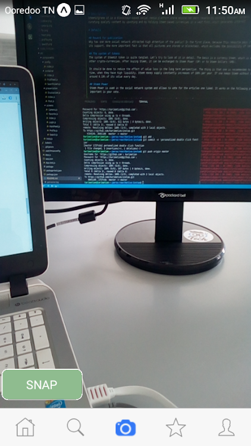

# Steemitgramm
<div>



</div>

# Description
Steemitgramm it is a blockchain-based social media platform where anyone can earn rewards by posting relevant content, 
curating quality content by upvoting and by holding Steem based currencies in a vest fund, which generates interest.

# Details

### Reward for publication
Why has one more social network attracted high attention of the public? In the first place, because this resource pays its users a reward for the unique content and its support. One more important fact is that all pictures are stored in blockchain, which excludes the possibility of censorship.

### The system of tokens
The system of Steemit token is quite tangled. Let’s try to look at it in detail. The basis is a currency Steem, which is a typical token like Bitcoin, Ethereum, and other crypto-currencies. After buying Steem, it can be exchanged to Steem Power (SP) or to Steem Dollars (SMD).

It should be done to reduce the effect of value loss in the long term perspective. The thing is that one is recommended to own Steem tokens for a short period of time, when they have high liquidity. Steem money supply constantly increases of 100% per year. If one keeps Steem without converting it to SP or SMD, one loses around 0.19% of its value every day.

### Steem Power
Steem Power is used in the social network system and allows to vote for the articles one liked. It works on the following principle: the more SP you have, the more important is your vote.

Steem Power was implemented by the development team with the aim of attracting long term investments in the project. The project creators explain this by the importance of such investments for the startups, and by the wish to protect from the speculators, who withdraw money, trying to earn on the short term fluctuations of token price. That is why one can convert an SP back to Steem in 104 weeks by equal parts. The correlation of Steem to SP is 9:1, however, it is assumed to be a bit bigger during the increase of Steem money supply.


# How it works
So, you’ve published an picture on SteemitGramm. Other users can vote for it, raising its ranking. The users’ votes have different value, depending of number of SP they own. The more votes the images has, the more earn the author and the users who vote for it and actively comment (they are called curators). The end reward is distributed the following way: 75% for author and 25% for curators. Half of reward is paid in Steem Power, and half in Steem Dollars.

One must remember that the published images are stored in the blockchain, so they are impossible to delete. So one should think twice before publish something in the social network.

# Installation
git clone https://gitlab.com/steemitgram/steemitgram-mobile.git

```
npm install
npm start
```

or

```
yarn install
yarn start
```


# Features:
 - Login screen:

     - SteemConnect: Token based authentication for Steem made easy https://steemconnect.com/
 - Home screen:(ready for tests)
 - Search screen (ready for tests)
 
     - string matching algorithm
 - Messaging/new message screens
 - Profile/profile edit & options screens
 - Preview of stories
 - Camera plugin included, video not supported yet (ready for tests)

This is just a theme, it does not have any backend. It only includes dummy data. 

“Here is my work. I worked fucking hard. I’m proud of it, and I think you’ll like it. Read it, use it and enjoy it.”
